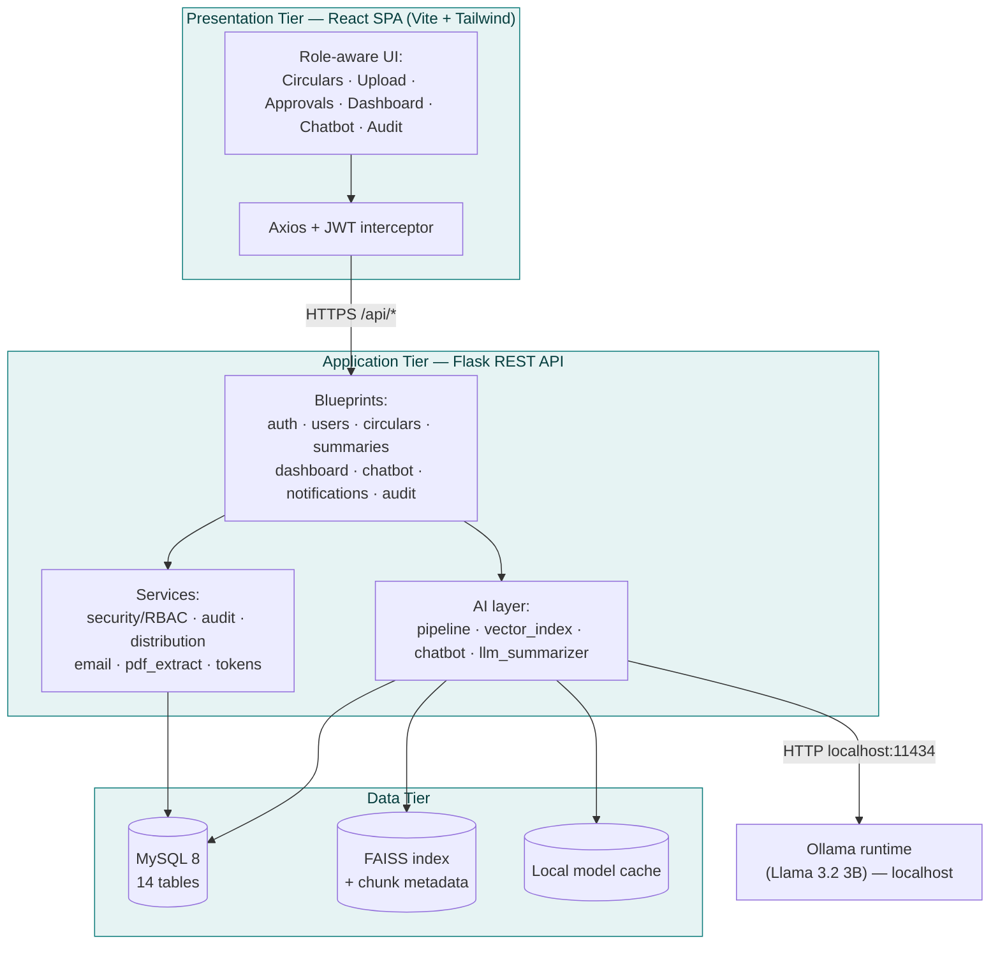
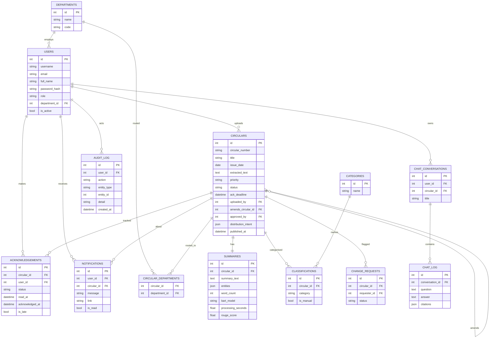
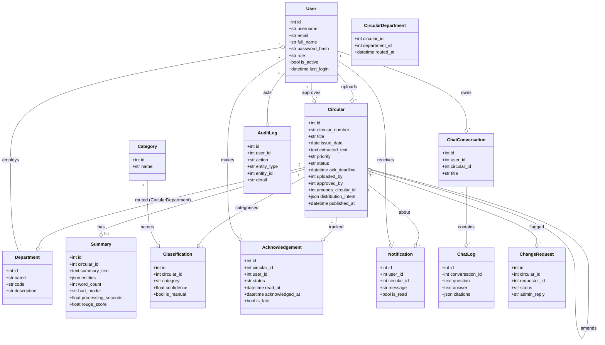
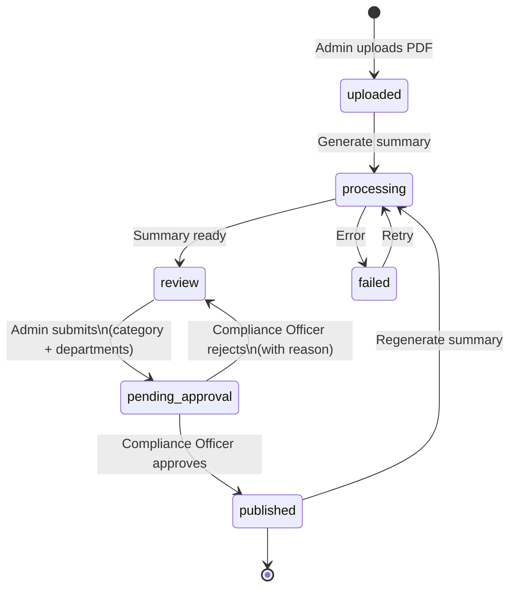
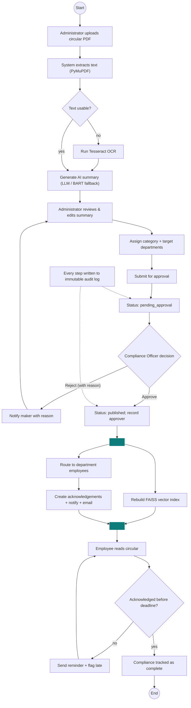
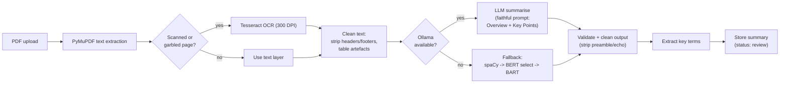
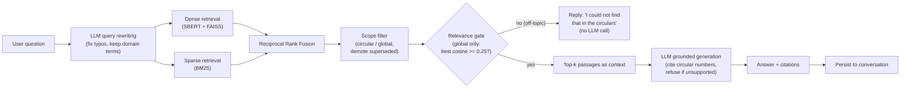
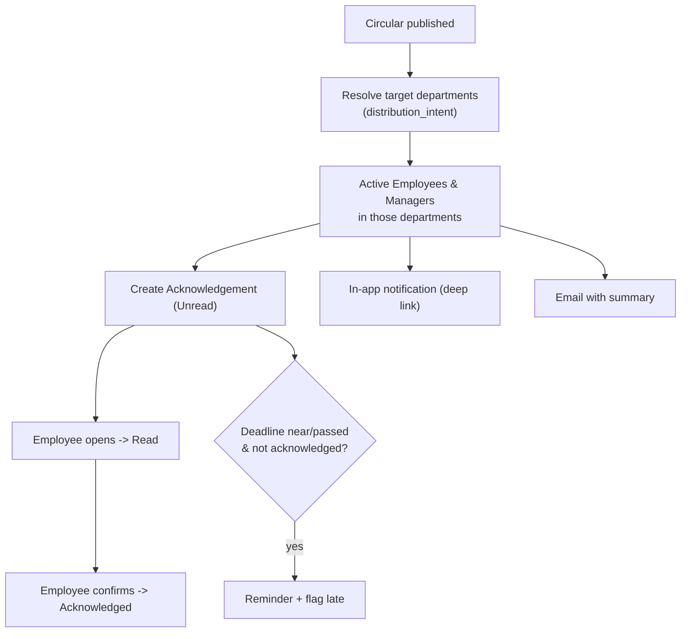
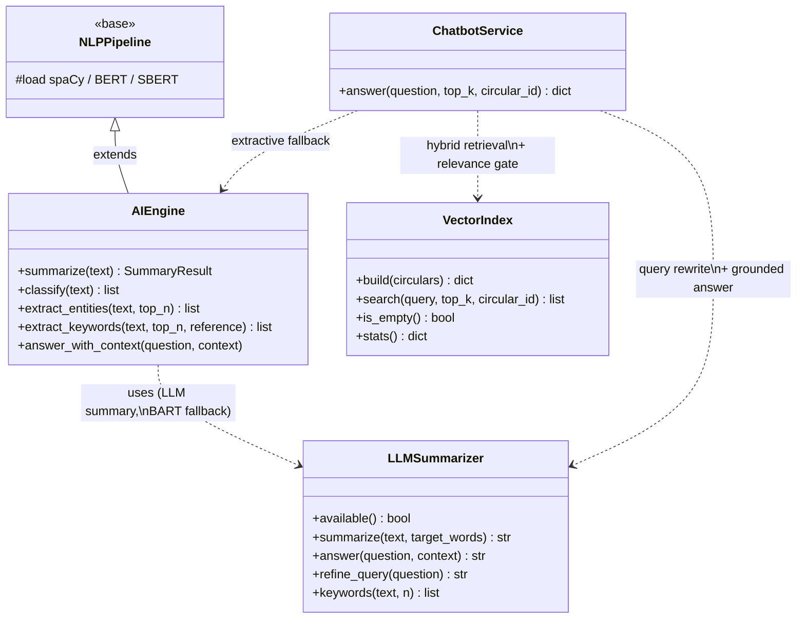

# Thesis Diagrams (Mermaid)

These render on GitHub and in Mermaid-aware editors (VS Code + Mermaid extension,
mermaid.live). To use in the thesis: paste into https://mermaid.live, then
**Export as PNG/SVG** and insert as a figure. Each diagram reflects the as-built
system.

---

## Figure 4.1 — System architecture (three-tier)



---

## Figure 4.2 — Entity–Relationship Diagram (core)



---

## Figure 4.3 — Domain model (class diagram)



> Note: `Classification.category` and `Category.name` are linked by name
> (string), not a hard FK, so administrators can rename/remove categories without
> orphaning existing classifications.

---

## Figure 4.4 — Circular lifecycle (state diagram)



---

## Figure 4.5 — End-to-end circular workflow (activity diagram)



> Modelled as a UML activity diagram: rounded nodes are start/end, diamonds are
> decisions, and the fork/join after publication shows that distribution and
> vector-index rebuild happen in parallel. The audit log annotation runs across
> the whole flow.

---

## Figure 5.1 — Summarization pipeline (flowchart)



---

## Figure 5.2 — RAG chatbot pipeline (flowchart)



---

## Figure 5.3 — Four-eyes approval workflow (sequence diagram)

```mermaid
sequenceDiagram
    actor Admin as Administrator (Maker)
    participant Sys as System
    actor CO as Compliance Officer (Checker)
    actor Emp as Employees

    Admin->>Sys: Upload circular + generate summary
    Sys-->>Admin: Summary (status: review)
    Admin->>Sys: Submit for approval\n(category + departments)
    Sys->>Sys: status = pending_approval
    Sys-->>CO: Notify: awaiting approval
    CO->>Sys: Review summary
    alt Approve
        CO->>Sys: Approve
        Sys->>Sys: status = published; record approver
        Sys->>Emp: Route + notify + email
        Sys-->>Admin: Notify: approved & published
    else Reject
        CO->>Sys: Reject (with reason)
        Sys->>Sys: status = review
        Sys-->>Admin: Notify: rejected + reason
    end
    Note over Sys: Every step written to immutable audit log
```

---

## Figure 5.4 — Distribution & acknowledgement flow



---

## Figure 5.5 — AI service layer (class diagram)



> `AIEngine` extends `NLPPipeline` (inheriting the loaded spaCy/BERT/SBERT
> models) and delegates fluent summarization to `LLMSummarizer`, falling back to
> its own BART path when Ollama is unavailable. `ChatbotService` composes
> `VectorIndex` (retrieval + the relevance gate) and `LLMSummarizer` (query
> rewriting and grounded generation), with `AIEngine`'s QA reader as the
> extractive fallback.
